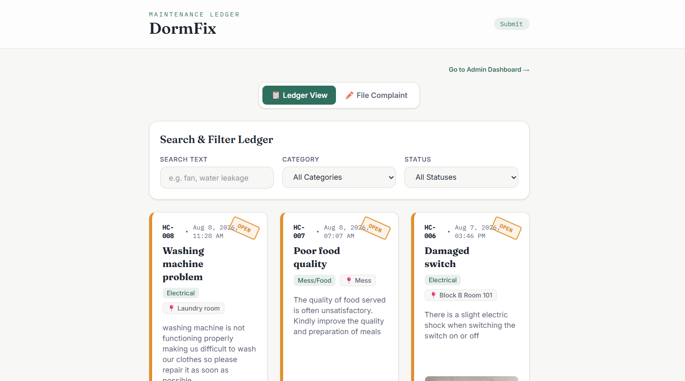

# DormFix - Hostel Complaint Tracker

Digital complaint tracking that turns hostel maintenance into a transparent, trackable ledger. Report, track, and resolve hostel issues — no more lost complaints in group chats.

**Live Now**  [dorm-fix-tau.vercel.app](https://dorm-fix-tau.vercel.app)

> Built as a selection-criteria project for my college's coding club — not a commercial/production product.

## 📌 Overview

**DormFix** is a ticket-based complaint management system built for hostel life. Every complaint becomes a numbered, trackable ticket — logged, categorized, stamped, and followed through to resolution — instead of getting lost in a group chat or a forgotten notice-board slip. The entire experience is built around a **"Maintenance Ledger"** design concept, so filing and tracking a complaint feels like flipping through a real maintenance logbook.

## 🌟 Key Features

- **Ticket-Style Complaint Cards** — Every complaint gets a unique ID (e.g. `HC-008`), a status-colored left bar, and a rotated stamp badge (`OPEN`, `RESOLVED`, etc.) that animates on status change
- **Smart Categorization** — Complaints sorted into Electrical, Plumbing, Mess/Food, Cleanliness, Noise, and Other
- **Photo Uploads** — Attach photo evidence via Cloudinary when filing a complaint
- **Search & Filter** — Find complaints instantly by keyword, category, or status
- **Admin Dashboard** — Passcode-gated "Complaints Ledger Console" with live stats (total tickets, pending action, escalated count, average rating) and one-click status controls
- **Auto-Escalation** — Complaints left open past 48 hours automatically escalate, so nothing slips through
- **Feedback & Ratings** — Students rate and comment once a complaint is marked resolved
- **Voice-to-Text Submission** — File a complaint by speaking, with an English/Hindi language toggle
- **Upvoting** — Support an existing open complaint instead of filing a duplicate
- **Fully Responsive** — 2–3 column grid on desktop, single column on mobile

## 🖼️ Snippets

**Ledger View**

*Student-facing complaint ledger — search, filter, and browse tickets*

**File Complaint**

*Submission form with voice-to-text input (English/Hindi) and photo upload*

**Admin Dashboard**

*Complaints Ledger Console — live stats and full status control*


## 🛠️ Tech Stack

**Frontend**

| React (Vite) | Tailwind CSS | Fraunces / Inter / IBM Plex Mono |
|---|---|---|

**Backend**

| Node.js | Express.js | MongoDB | Mongoose |
|---|---|---|---|

**Services**

| Cloudinary (photo uploads) | Web Speech API (voice input) |
|---|---|

**DevOps & Deployment**

| Git & GitHub | Vercel (frontend) | Render (backend) |
|---|---|---|

## 🚀 Getting Started

### Prerequisites
- Node.js v24.18.1 (developed and tested on this version — older LTS versions like v18/v20 are likely compatible but not verified)
- npm or yarn
- MongoDB instance (local or Atlas)
- Cloudinary account for photo uploads

### Installation and Setup

**Clone the repository**
```bash
git clone https://github.com/ZiyaAnjum/DormFix.git
cd DormFix
```

**Install dependencies**

Backend:
```bash
cd backend
npm install
```

Frontend:
```bash
cd frontend
npm install
```

**Set up environment variables**

Copy the example file in `backend`:
```bash
cp backend/.env.example backend/.env
```

Fill in your environment variables in `backend/.env`:
```
MONGODB_URI=your_mongodb_connection_string
CLOUDINARY_CLOUD_NAME=your_cloud_name
CLOUDINARY_API_KEY=your_api_key
CLOUDINARY_API_SECRET=your_api_secret
ADMIN_PASSCODE=your_admin_passcode
PORT=5000
```

And in `frontend/.env.production`:
```
VITE_API_URL=https://your-backend-url.onrender.com/api
```

**Run the development servers**

Backend:
```bash
cd backend
npm run dev
```

Frontend:
```bash
cd frontend
npm run dev
```

Open `http://localhost:5173` in your browser.

## 📂 Project Structure

```
DORMFIX/
├── backend/
│   ├── config/
│   ├── middleware/
│   ├── models/
│   ├── routes/
│   ├── utils/
│   ├── .env.example
│   ├── package.json
│   └── server.js
│
├── frontend/
│   ├── public/
│   ├── src/
│   ├── .env.production
│   ├── .gitignore
│   ├── index.html
│   ├── package.json
│   └── vite.config.js
│
├── screenshots/
│   ├── ledger-view.png
│   ├── file-complaint-1.png
│   └── admin-dashboard-1.png
│
├── .gitignore
└── README.md
```

## 🎨 Design System — "Maintenance Ledger"

| Element | Value |
|---|---|
| Background | `#F7F7F5` |
| Text | `#1F2430` |
| Accent | `#2F6F5E` |
| Status: Open | `#E08E2B` |
| Status: In-progress | `#3D6FD9` |
| Status: Resolved | `#3D9B6B` |
| Status: Escalated | `#D9473D` |
| Headings | Fraunces |
| Body | Inter |
| IDs / Timestamps | IBM Plex Mono |

## 🧗 Challenges I Faced

**Voice-to-text not working** — The Web Speech API integration for the voice-to-text submission (with English/Hindi toggle) wasn't picking up any input no matter what got changed — permissions, browser compatibility, language configs. After a lot of back and forth, it turned out to be my laptop's microphone hardware not functioning at all, not a code issue. Good reminder to rule out hardware/environment early instead of assuming the bug is always in the logic.

**MongoDB Atlas connection failures** — The backend couldn't connect to the MongoDB cluster at all — kept failing silently with no clear error. Turned out to be a network access + DNS issue: the cluster's IP access list didn't include my current network, and local DNS resolution was flaky. Fixing the IP access list to `0.0.0.0/0` (allow from anywhere) and switching DNS to `8.8.8.8` resolved it.

## 🔧 What I'd Improve

Given more time, there's a lot I'd push further — I intentionally scoped down to ship a solid, fully working project rather than a broken, over-ambitious one. Improvements I'd prioritize next:

- **Real authentication for admin** — currently a simple passcode string comparison; would move to proper hashed credentials with JWT-based sessions instead
- **Notifications after escalation** — alert the student (and possibly the warden) when a complaint auto-escalates past 48 hours, instead of the status silently changing
- **Rate limiting / abuse prevention on submissions** — nothing currently stops duplicate or spam ticket flooding beyond upvoting existing complaints
- **Image compression before Cloudinary upload** — large photo uploads currently go through unoptimized, which would slow load times as usage grows
- **Pagination for the ledger view** — right now every complaint loads at once; fine for a demo, but wouldn't scale to a real hostel's ticket volume
- **SMS/email fallback for critical complaints** — for issues like electrical or safety hazards, a push-only notification isn't reliable enough; a fallback channel would matter in a real deployment

## 👤 Author

**Ziya Anjum**
B.E. Artificial Intelligence & Machine Learning, Anjuman Institute of Technology and Management, Bhatkal

[GitHub](https://github.com/ZiyaAnjum) · [LinkedIn](https://linkedin.com/in/ziya-anjum)

